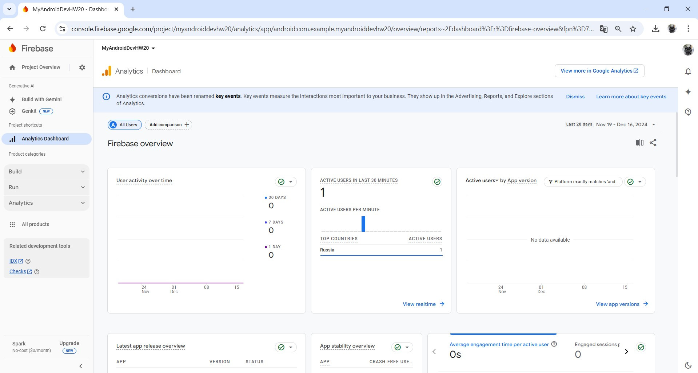
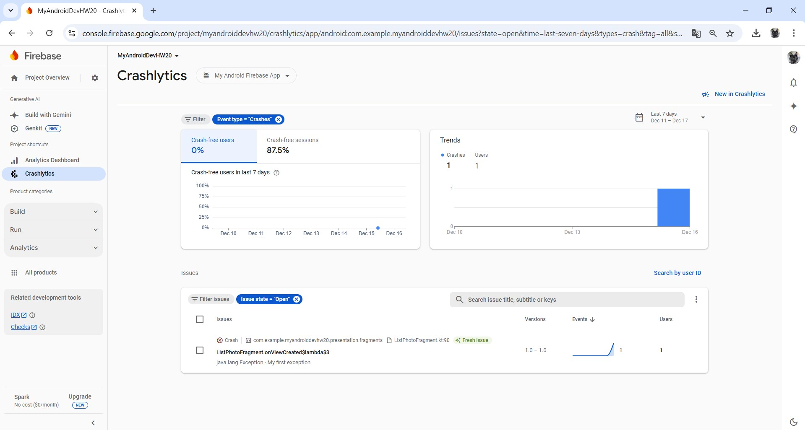
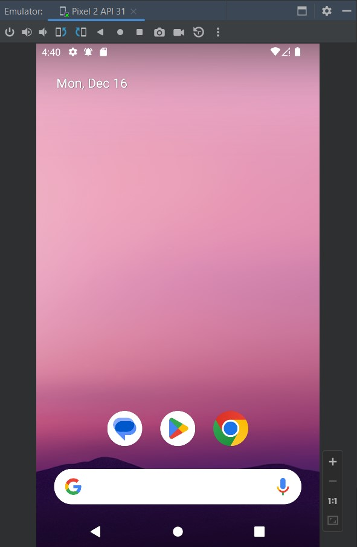
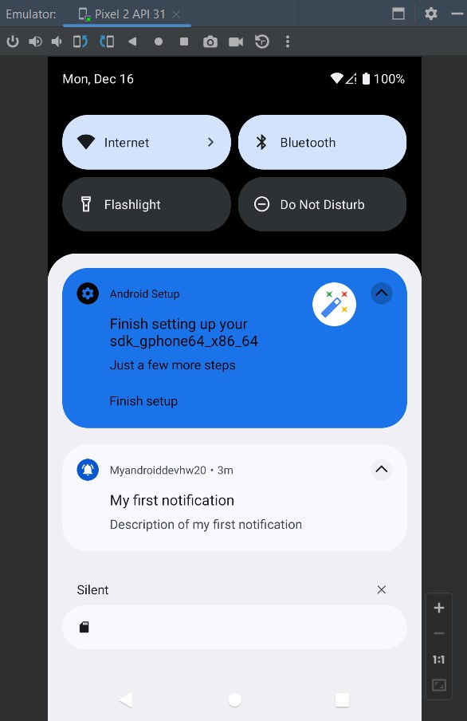

# Урок 20. Firebase

### Цели практической работы
 
● Применить знания о работе с Firebase к проекту.
● Закрепить на практике принципы работы с сервисом Crashlytics и уведомлениями, сообщениями от сервиса Firebase.
 
### Что входит в задание
 1. Подключить Firebase к проекту.
 2. Настроить проект для получения отчётов о сбоях и ошибках,  происходящих в приложении.
 3. Настроить проект для получения пуш-уведомлений от сервиса Firebase.

===============================================================================

## Демонстрация решения:

